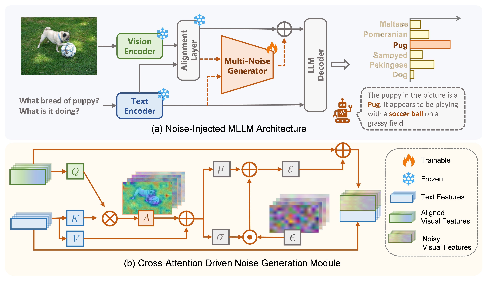

## [AAAI 2026] MuNG: Exploring Beneficial Noise Injection in MLLMs

## Introduction

This repository provides a PyTorch implementation of **MuNG (Multimodal Noise Generator)**, a lightweight fine-tuning method for Multimodal Large Language Models. The corresponding paper has been accepted by **AAAI 2026**.



<br>
<a href="https://arxiv.org/pdf/2511.12917"></a>


## Getting Started

###  Step 1. Clone Repositories

First, clone the required base repositories:

```bash
git clone https://github.com/QwenLM/Qwen2.5-VL.git
cd Qwen2.5-VL
git clone https://github.com/zhuruishu0848/MuNG
```

Place the MuNG-related code in the repositories, or adjust the script paths accordingly.

```bash
cp -r MuNG/datasets MuNG/noise_generator ./
```

---

###  Step 2. Install Dependencies

Please follow the respective instructions to set up the environments:

* [Qwen2.5-VL Quickstart](https://github.com/QwenLM/Qwen2.5-VL#Quickstart)

---

###  Step 3. Prepare Datasets

Using the MMPRv1.1 dataset for fine-tuning as an example.
Download the [MMPR-v1.1](https://huggingface.co/datasets/OpenGVLab/MMPR-v1.1) dataset and place it under the `datasets/` directory.

Then convert it to the format required by Qwen2.5-VL:

```bash
python datasets/MMPR_shuffle.py
```
---
### Step 4. Download Weights

Please download the pretrained weights of **Qwen2.5-VL** from [Qwen2.5-VL-3B-Instruct](https://huggingface.co/Qwen/Qwen2.5-VL-3B-Instruct).
After downloading, place the model weights into the `checkpoints/base/` directory.  

---

### Step 5. Fine-tuning

Select the appropriate script to fine-tune QwenVL2.5vl model with noise injection:

```bash
# Fine-tune Qwen2.5-VL
bash noise_generator/finetune/MMPR-shuff/mmpr_finetune_ng.sh
```

---
### Step 6. Evaluation

We use [VLMEvalKit](https://github.com/open-compass/VLMEvalKit) for evaluation.

---
## Acknowledgments

This project is built upon the following open-source resources. Thanks for their excellent works.

* [Qwen2.5-VL](https://github.com/QwenLM/Qwen2.5-VL)
* [InternVL](https://github.com/OpenGVLab/InternVL)
* [VLMEvalKit](https://github.com/open-compass/VLMEvalKit)

## Citation
If you find our paper and code useful in your research, please consider citing our work:

```
@misc{zhu2025exploreinjectbeneficialnoise,
      title={Explore How to Inject Beneficial Noise in MLLMs}, 
      author={Ruishu Zhu and Sida Huang and Ziheng Jiao and Hongyuan Zhang},
      year={2025},
      eprint={2511.12917},
      archivePrefix={arXiv},
      primaryClass={cs.CV},
      url={https://arxiv.org/abs/2511.12917}, 
}
```